# Metodo Custom Propio de Estimacion de Proyectos adaptados a un contexto de desarrollo de software

**Objetivo del documento:** Describir una metodología propia para estimar tiempos y costos en proyectos de software, considerando factores como seniority, automatización, tareas paralelas y riesgos.

**Motivación:** los modelos tradicionales (PERT, COCOMO, CPM) son insuficientes para reflejar la realidad moderna (seniority, automatización, tareas paralelas, riesgos, etc.).

**Alcance:** esta metodología servirá como base para desarrollar una calculadora interactiva de estimaciones.

## Problemas con modelos clasicos

- **PERT (Program Evaluation and Review Technique)** se centra en estimar duración, pero no contempla bien cosas como equipos paralelos, seniority ni automatización.

- **COCOMO (Constructive Cost Model)** se basa en líneas de código o puntos de función, pero es rígido y fue diseñado para contextos de los 80-90, cuando los proyectos eran más predictivos.

## Elementos adicionales propuestos

1. Concurrencia y dependencias → Aquí nos sirve mucho usar un modelo de red de tareas, similar a un diagrama PERT avanzado, pero deberíamos integrarlo con herramientas tipo CPM (Critical Path Method) que identifican qué tareas pueden correr en paralelo y cuáles son el cuello de botella.

2. Seniority y perfiles de las personas → Esto rara vez lo consideran los modelos clásicos. Aquí lo que propongo es:

    - Crear un catálogo de perfiles (ej., junior, semi, senior, tech lead) con coeficientes de productividad estimada.

    - Asociar cada tarea con un perfil óptimo y ajustar los tiempos según quién lo ejecuta (ej., un senior tarda 60% del tiempo de un junior).

3. Automatización y aceleradores → Podemos permitir marcar tareas como automatizables y tener reglas predefinidas para cuánto tiempo se reduce cuando se usan herramientas, scripts, CI/CD, frameworks, etc.


5. Ajustes dinámicos → Idealmente, la calculadora debería permitir simular cambios (una vez realizada al menos la estimacion inicial):

    - ¿Qué pasa si agrego otro senior al equipo?
    - ¿Qué pasa si automatizo este paso?
    - ¿Qué pasa si divido esta tarea en dos?

Eso es algo que ningún modelo clásico hace bien por sí solo, y que si lo podemos hacer real time de una manera eficiente y bonita, seremos los unicos.

Yo recomendaría no casarnos ni intentar solo con un modelo, en base a las investigaciones que realice de los metodos de estimacion, ninguno sirve para estimar considerando lo mencionado previamente. A raiz de esto, pense en crear un metodo propio, tomando ciertas herramientas como base, pero adaptandolo a las necesidades que queremos cubrir. La idea seria escalar este modelo y afinarlo.

* Usar PERT como núcleo de tiempo, pero reforzado con:
    - Dependencias + caminos críticos (CPM).
    - Ajustes por seniority (con coeficientes multiplicadores).
    - Reducción de tiempos por automatización (con porcentajes).
    - Factores de riesgo (como en Monte Carlo simulations, si te animas a ir más lejos).

Incluso me encantaria que pudiesemos plantear un motor de estimación por escenarios: el usuario puede cargar diferentes configuraciones (más gente, más seniors, menos automatización, más tareas paralelas) y ver cómo cambia el resultado, una vez realizada la primera estimacion base, y asi poder comparar.

## Modelo Conceptual (Muy verde)

1. **Proyecto**
    * Nombre
    * Descripción
    * Equipo
    * Tarea []

2. **Tarea**
    * Nombre
    * Descripción
    
    * Estimación por rangos:
      - *Optimista (O), Más probable (M), Pesimista (P).*

    * Dependencias (qué tareas deben completarse antes - Predecesoras / Sucesoras)
    * ¿Es automatizable? (sí/no, % de ahorro)
    * Perfil recomendado (junior, semi, senior, etc.)

3. **Perfil de Persona:**
    * Nombre (junior, semi, senior, tech lead…)
    * Productividad (ej., 0.6x, 1x, 1.4x)
    * Costo/hora (opcional, si queremos calcular también presupuesto - FUTURO)

    * Restricciones: 
      - No todas las tareas pueden ser realizadas por cualquier perfil.
      - Limitación natural del paralelismo: no puedo correr 10 tareas paralelas si tengo solo 2 desarrolladores.

4. **Equipo**
    * Lista de personas asignadas
    * Asignación de tareas

5. **Riesgos y retrasos**
    * Riesgos técnicos (tecnologías nuevas, integraciones externas).
    * Riesgos organizacionales (cambios de alcance, rotación de personal).\
    * Riesgos externos (proveedores, regulaciones).
    - **Simulación de impacto:** usando factores multiplicadores de tiempo o modelos Monte Carlo para escenarios probabilísticos.

## Modelo matemático base

  Por cada tarea

  ```
  (optimista + 4 * probable + pesimista) / 6  --> Calculo PERT

  1. Luego se multiplica por SeniorityFactor:
    - Junior: x1
    - SemiSenior: x0.8
    - Senior: x0.6
    - TechLead: x0.5

  2. Se Sustrae Savings de Automatizacion (Si aplica)

  3. Se multiplica por factor de riezgos contemplados por el usuario. (Podemos ofrecer algunos preconfigurados)

  Ejemplo rapido:

  Si una tarea es de 10h promedio, un senior la haría en 10h × 0.6 = 6h;
  si además tiene un ahorro por automatización del 30%, sería 6h × 0.7 ≈ 4.2h.

  Luego, para calcular el proyecto completo:

  Armamos un grafo de dependencias (como en CPM) → identificamos que puede hacerse en paralelo y qué depende del camino crítico.

  ```

### Casos contemplados en los que la metodologia sirve

  | Caso                                       | Ejemplo                                                  |
  | ------------------------------------------ | -------------------------------------------------------- |
  | Proyecto chico, pocos recursos             | App pequeña con 2 developers                             |
  | Proyecto grande, muchos equipos paralelos  | Sistema corporativo con 3 equipos trabajando en paralelo |
  | Alta automatización                        | Proyecto con infraestructura CI/CD sólida                |
  | Bajo seniority                             | Equipo nuevo con poco conocimiento                       |
  | Riesgos externos altos                     | Proyecto que depende de aprobación gubernamental         |
  | Incremento de equipo en mitad del proyecto | Añadir developers a mitad de camino                      |


## Diferencias entre nuestra propuesta y modelos clasicos

  | Aspecto                  | Modelos clásicos (PERT, COCOMO) | Nuestra metodología   |
  | ------------------------ | ------------------------------- | --------------------- |
  | Considera seniority      | No                              | Sí                    |
  | Considera automatización | No                              | Sí                    |
  | Tareas paralelas         | Limitadas                       | Sí, modeladas con DAG |
  | Simulación de escenarios | No                              | Sí                    |
  | Inclusión de riesgos     | Limitada o superficial          | Sí, configurable      |


## Flujo de la App (Inicial)

  1. Crear proyecto → ingresar tareas, dependencias, perfiles.
  2. Asignar equipo → quién hace qué.
  3. Simular → calcular tiempo total, mostrar camino crítico, ver ahorro por automatización.
  4. (Post) Escenarios → modificar equipo o parámetros y comparar resultados.

---

# Ejemplo (Basico) práctico: Estimación del proyecto usando metodología propia

### Escenario
  * Proyecto: Desarrollo de una web app para gestión de tareas.
  * Equipo:
      - Backend Senior → productividad 0.6x (trabaja 40h/semana).
      - Backend Semi-senior → productividad 0.8x (40h/semana).
      - Frontend Junior → productividad 1x (40h/semana).

  Queremos estimar cuánto tardarán en completar el proyecto, considerando paralelismo, dependencias, automatización y riesgos.

## Paso 1: Definir tareas

  | Tarea ID | Nombre                  | Optimista (O) | Más probable (M) | Pesimista (P) | Automatización | Perfil           |
  | -------- | ----------------------- | ------------- | ---------------- | ------------- | -------------- | ---------------- |
  | T1       | Diseño UI               | 8h            | 12h              | 20h           | No             | Frontend         |
  | T2       | Crear API Usuarios      | 16h           | 24h              | 40h           | Sí (20%)       | Backend          |
  | T3       | Crear API Tareas        | 16h           | 24h              | 40h           | Sí (20%)       | Backend          |
  | T4       | Integrar Front con APIs | 12h           | 20h              | 32h           | No             | Frontend         |
  | T5       | Testing completo        | 12h           | 16h              | 24h           | Sí (30%)       | Backend/Frontend |


## Paso 2: Definir dependencias

  - T1 → T4 (no se puede integrar hasta tener UI lista).
  - T2 y T3 → T4 (no se puede integrar hasta tener APIs listas).
  - T4 → T5 (no se puede testear hasta integrar).

  Visualmente:

  ```
    T1
       └── T4 ──┐
    T2 ──┘      │
    T3 ──┘      └── T5
  ```

## Paso 3: Calcular duracion base 

 ```
  (optimista + 4 * probable + pesimista) / 6  --> Calculo PERT
 ```

  | Tarea | Cálculo              | Resultado |
  | ----- | -------------------- | --------- |
  | T1    | (8 + 4×12 + 20) / 6  | 12h       |
  | T2    | (16 + 4×24 + 40) / 6 | 25.3h     |
  | T3    | (16 + 4×24 + 40) / 6 | 25.3h     |
  | T4    | (12 + 4×20 + 32) / 6 | 20.7h     |
  | T5    | (12 + 4×16 + 24) / 6 | 16.7h     |

## Paso 4: Aplicar automatización

  | Tarea  | Ahorro (%) | Duración ajustada  |
  | ------ | ---------- | ------------------ |
  | T2     | 20%        | 25.3 × 0.8 ≈ 20.2h |
  | T3     | 20%        | 25.3 × 0.8 ≈ 20.2h |
  | T5     | 30%        | 16.7 × 0.7 ≈ 11.7h |
  | T1, T4 | 0%         | Igual que antes    |

## Paso 5: Ajustar por seniority

  | Tarea | Asignado a         | Productividad factor | Duración final     |
  | ----- | ------------------ | -------------------- | ------------------ |
  | T1    | Frontend Junior    | 1x                   | 12h                |
  | T2    | Backend Senior     | 0.6x                 | 20.2 × 0.6 ≈ 12.1h |
  | T3    | Backend Semi       | 0.8x                 | 20.2 × 0.8 ≈ 16.2h |
  | T4    | Frontend Junior    | 1x                   | 20.7h              |
  | T5    | Backend + Frontend | promedio ≈ 0.8x      | 11.7 × 0.8 ≈ 9.4h  |


## Paso 6: Calcular paralelismo y camino crítico

  1. **Semana 1 (paralelo):**
      * T1 (12h → Junior).
      * T2 (12.1h → Senior).
      * T3 (16.2h → Semi).
     
    → todo hecho en paralelo.

  2. **Semana 2:**
      * T4 (20.7h → Junior) 
        - solo puede arrancar cuando T1, T2, T3 están listos.

      * Mientras, Backend puede ayudar en otros ajustes o preparar tests.

  3. **Semana 3:**
      * T5 (9.4h → Backend + Frontend).

## Duracion total estimada (sin riesgos)

  | Etapa            | Tiempo                         |
  | ---------------- | ------------------------------ |
  | Paralelo inicial | \~16.2h (\~2 días)             |
  | Integración      | \~20.7h (\~3 días)             |
  | Testing          | \~9.4h (\~1.5 días)            |
  | **Total**        | ≈ 7 días hábiles (1.5 semanas) |

## Paso 7: Simular riesgos
  * Tecnológicos (integración puede fallar).
    - Valor de riesgo: 1.05 (5% más tiempo).

  * Organizacionales (junior puede demorar).
    - Valor de riesgo: 1.1 (10% más tiempo).

  * Externos (infraestructura, servicios).
    - Valor de riesgo: 1.05 (5% más tiempo).

    → Aumentamos duración en 20%:
    7 días × 1.20 ≈ 8.4 días hábiles.

## Resultado final
    
  Proyecto estimado en ~9 días hábiles para un equipo de:
  
  * Backend Senior + Semi + Frontend Junior,

  Considerando paralelismo, automatización, seniority y riesgos.

  ```
    T1 (12h) ─────┐
                  ├─> T4 (20.7h) ──> T5 (9.4h)
    T2 (12.1h) ───┘
    T3 (16.2h) ───┘
  ```

  ### Observaciones
  * Si solo tuviéramos un backend, el proyecto crecería en tiempo por falta de paralelismo.

  * Si asignáramos tareas backend al junior, el tiempo crecería por menor productividad.

  * Si automatizáramos más tareas, el tiempo podría reducirse aún más.

  * Los riesgos pueden ser modulados según contexto.

---

# Ejemplo (Avanzado) práctico: Estimación del proyecto usando metodología propia

  Este ejemplo detalla un metodo completo de estimación de un proyecto software usando nuestra metodología extendida, considerando:
  * Paralelismo de tareas (modelado con DAG).
  * Seniority y productividad de cada miembro.
  * Automatización.
  * Infraestructura y dependencias técnicas.
  * Riesgos asociados: bajas de personal, cambios tecnológicos, retrasos externos.


## Escenario del proyecto
  * **Proyecto:** Desarrollo de plataforma SaaS para gestión de inventarios + despliegue en cloud.

  * **Equipo:**
    - Frontend:
      - Frontend Senior → productividad 0.6x (trabaja 40h/semana).
      - Frontend Semi-senior → productividad 0.8x (40h/semana).
      - Frontend Junior → productividad 1x (40h/semana).
    - Backend:
      - Backend Senior → productividad 0.6x (trabaja 40h/semana).
      - Backend Semi-senior → productividad 0.8x (40h/semana).
      - Backend Junior → productividad 1x (40h/semana).
    - DevOps:
      - Tech Lead → productividad 0.5x (trabaja 40h/semana).

## Lista de tareas: 

  | Tarea ID | Nombre                                  | Optimista (O) | Más probable (M) | Pesimista (P) | Automatización | Perfil asignado        |
  | -------- | --------------------------------------- | ------------- | ---------------- | ------------- | -------------- | ---------------------- |
  | T1       | Diseño UI + prototipo                   | 16h           | 24h              | 40h           | No             | Front Semi + Senior    |
  | T2       | Setup Infraestructura Cloud             | 24h           | 40h              | 60h           | Sí (30%)       | Infra Tech Lead        |
  | T3       | Desarrollo API de autenticación         | 16h           | 32h              | 48h           | Sí (20%)       | Backend Senior         |
  | T4       | Desarrollo módulo inventario (backend)  | 40h           | 64h              | 100h          | Sí (20%)       | Backend Semi + Junior  |
  | T5       | Desarrollo módulo inventario (frontend) | 32h           | 48h              | 72h           | No             | Front Semi + Junior    |
  | T6       | Integración API frontend-backend        | 24h           | 36h              | 60h           | No             | Front + Backend Senior |
  | T7       | Configuración CI/CD                     | 20h           | 32h              | 50h           | Sí (40%)       | Infra Tech Lead        |
  | T8       | Testing funcional y de stress           | 32h           | 48h              | 80h           | Sí (30%)       | Front + Backend equipo |
  | T9       | Documentación técnica + soporte inicial | 16h           | 24h              | 40h           | Parcial (20%)  | Infra + Backend Senior |

## Calculo base

  Usamos la fórmula de **PERT** para calcular la duración promedio de cada tarea:

  | Tarea | Resultado |
  | ----- | --------- |
  | T1    | 26h       |
  | T2    | 39h       |
  | T3    | 33h       |
  | T4    | 66h       |
  | T5    | 50h       |
  | T6    | 38h       |
  | T7    | 33h       |
  | T8    | 51h       |
  | T9    | 26h       |

## Ajuste por automatización

  | Tarea      | Ahorro (%) | Duración ajustada |
  | ---------- | ---------- | ----------------- |
  | T2         | 30%        | 27h               |
  | T3         | 20%        | 26.4h             |
  | T4         | 20%        | 52.8h             |
  | T7         | 40%        | 19.8h             |
  | T8         | 30%        | 35.7h             |
  | T9         | 20%        | 20.8h             |
  | T1, T5, T6 | 0%         | Igual             |

## Ajuste por seniority
  
  | Tarea | Asignado a                   | Factor productividad | Duración final |
  | ----- | ---------------------------- | -------------------- | -------------- |
  | T1    | Semi (0.8x) + Senior (0.6x)  | promedio ≈ 0.7x      | 18.2h          |
  | T2    | Infra Tech Lead (0.5x)       | 0.5x                 | 13.5h          |
  | T3    | Backend Senior (0.6x)        | 0.6x                 | 15.8h          |
  | T4    | Semi (0.8x) + Junior (1x)    | promedio ≈ 0.9x      | 47.5h          |
  | T5    | Semi (0.8x) + Junior (1x)    | promedio ≈ 0.9x      | 44.4h          |
  | T6    | Seniors (0.6x)               | 0.6x                 | 22.8h          |
  | T7    | Infra Tech Lead (0.5x)       | 0.5x                 | 9.9h           |
  | T8    | Equipo (promedio ≈ 0.8x)     | 0.8x                 | 28.6h          |
  | T9    | Senior (0.6x) + Infra (0.5x) | promedio ≈ 0.55x     | 11.4h          |

## Modelado de Paralelismo (DAG)

  ```
    T2 ──┐
         ├── T7 ──┐
    T1 ──┐        ├── T6 ──┐
    T3 ──┘        │        │
    T4 ──┐        │        ├── T8 ── T9
    T5 ──┘        │        │
                  └────────┘
  ```

## Riesgos considerados:

  1. **Baja de personal (10%):**
      - Se calcula buffer de +10% en tareas largas (T4, T5, T8).

  2. **Obsolescencia tecnológica (5%):**
      - Se calcula buffer de +5% en integración (T6).

  3. **Retrasos externos (15%):**
      - Se calcula buffer general del 15% sobre total.


## Tiempo total estimado (sin riesgos)

  | Tarea | Duración ajustada | Buffer (%) | Duración final |
  | ----- | ----------------- | ---------- | -------------- |
  | T1    | 18.2h             | 0%         | 18.2h          |
  | T2    | 13.5h             | 0%         | 13.5h          |
  | T3    | 15.8h             | 0%         | 15.8h          |
  | T4    | 47.5h             | +10%       | 52.3h          |
  | T5    | 44.4h             | +10%       | 48.8h          |
  | T6    | 22.8h             | +5%        | 23.9h          |
  | T7    | 9.9h              | 0%         | 9.9h           |
  | T8    | 28.6h             | +10%       | 31.5h          |
  | T9    | 11.4h             | 0%         | 11.4h          |

  | Etapa                     | Tiempo base                                  |
  | ------------------------- | -------------------------------------------- |
  | Paralelo inicial          | \~5 días                                     |
  | Integración               | \~3 días                                     |
  | Testing + Documentos      | \~3 días                                     |
  | Total sin buffer          | \~11 días                                    |
  | Total con riesgos (\~25%) | \~13.75 días ≈ 14 días hábiles (\~3 semanas) |


# Pantallas de la App

## Definicion del proyecto
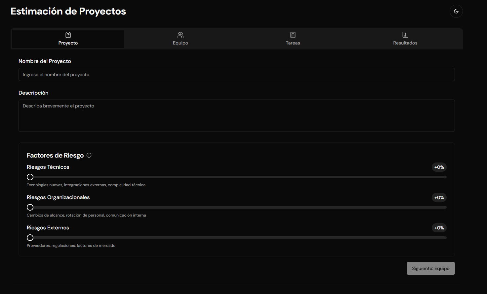


## Definicion del equipo

Nota: 
  * Senority: Junior, SemiSenior, Senior, Tech Lead.
  * El rol se dejo como un campo de texto y no como un select, para que el usuario pueda definirlo como quiera. La idea es sea flexible con los puestos de trabajo.

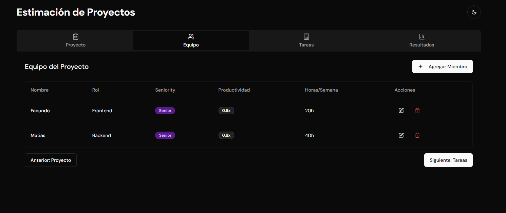
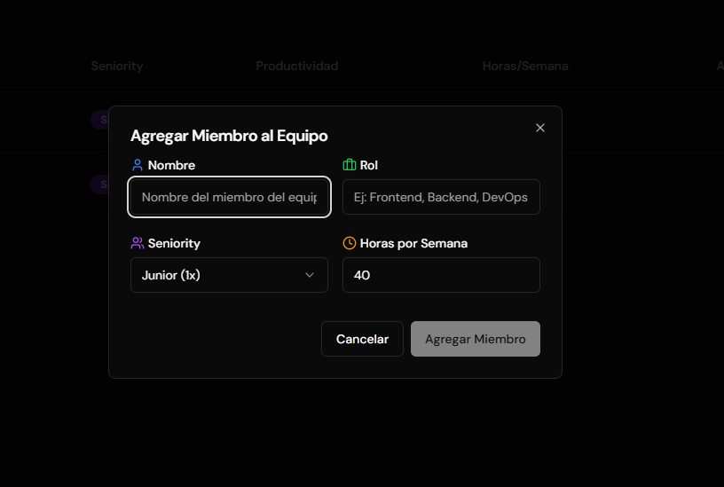
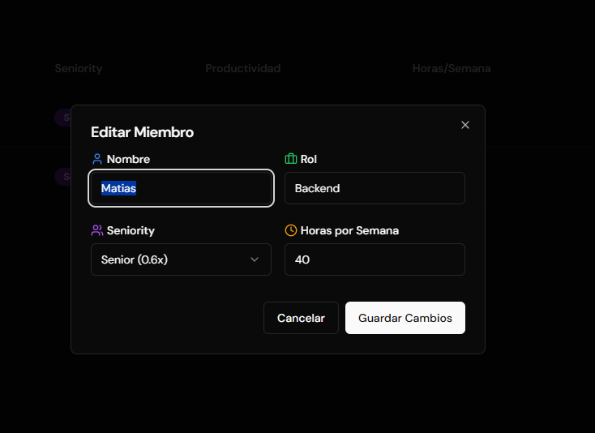


## Definicion de tareas

Nota: En la app se pueden agregar tareas, asignarles un perfil recomendado para llevar adelante dicha tarea y definir si son automatizables o no, con su respectivo valor de ahorro. Se pueden agregar dependencias entre tareas, para considerar a la hora de paralelizar y el sistema calculará automáticamente el tiempo total estimado del proyecto.

Nota 2: 
 * Tipo de Tareas: Frontend, Backend, DevOps, Otros.
 * Tipo de Perfil Recomendado: Junior, SemiSenior, Senior, Tech Lead.
 * Las dependencias entre tareas se asignan en la edicion de las mismas y se pueden agregar tantas como se necesiten, siempre que sean criteriosas con respecto al flujo.

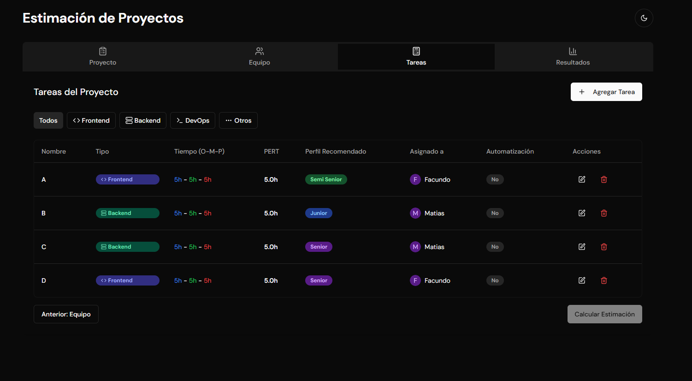
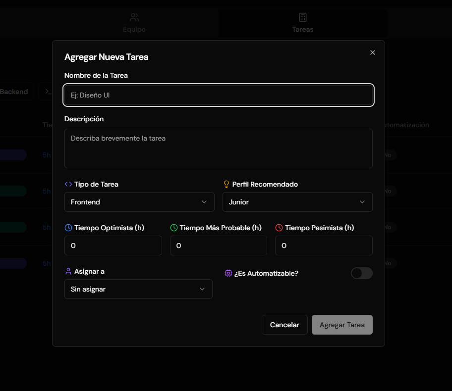
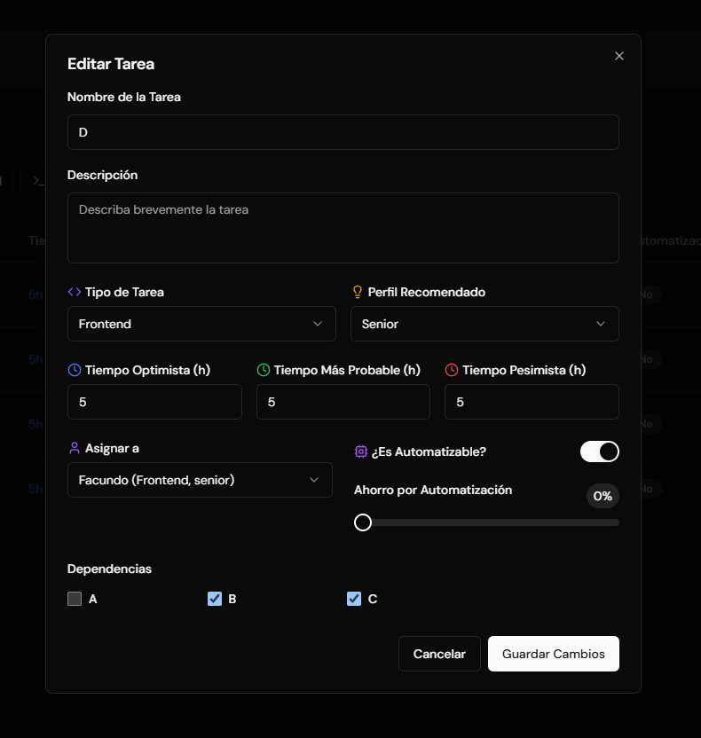

## Resultados 

En esta seccion se puede ver el resultado de la estimacion del proyecto, con el tiempo total estimado y el desglose por tareas. Se puede ver el tiempo total estimado considerando los riesgos y la suma de factores de riesgo.

Ademas, se puede ver de una manera sencilla y grafica la distribucion de tareas y asignaciones para cada recurso, con el objetivo de ver el porcentaje de aprovechamiento de cada uno, con el objetivo de saber ajustar la distribucion o los miembros del equipo. 

Se hace un recuento de las tareas agrupadas por tipo [Frontend, Backend, DevOps, Otros] y se muestra el tiempo total estimado por cada una de ellas.

Luego, viene el plato fuerte de la app, se puede apreciar la secuencia del camino critico del proyecto, con las tareas que son dependientes entre si. Luego se presenta un diagrama de Gantt, donde se puede ver la distribucion de tareas y el tiempo estimado para cada una de ellas, ADEMAS DE VER DE MANERA VISUAL EL PARALISMO DE LAS TAREAS y la distribucion de las mismas con respecto al tiempo en horas, pero considerando dias de jornadas estandar de trabajo de 8 horas. Por ultimo, se presenta una tabla con las asignaciones de cada persona, para poder visualizar la distribucion automatica, o en caso de haberla hecho manualmente, ver el inicio y fin de las mismas con respecto al tiempo total.

La ultima funcionalidad que se presenta, es la comparacion de escenarios, donde se pueden comparar diferentes escenarios de estimacion, para ver como afecta el tiempo total estimado y la distribucion de tareas y recursos. Se pueden agregar o quitar miembros del equipo, cambiar el perfil recomendado de las tareas, agregar o quitar automatizacion, etc; y ver de una manera rapida cual es la mejor alternativa.

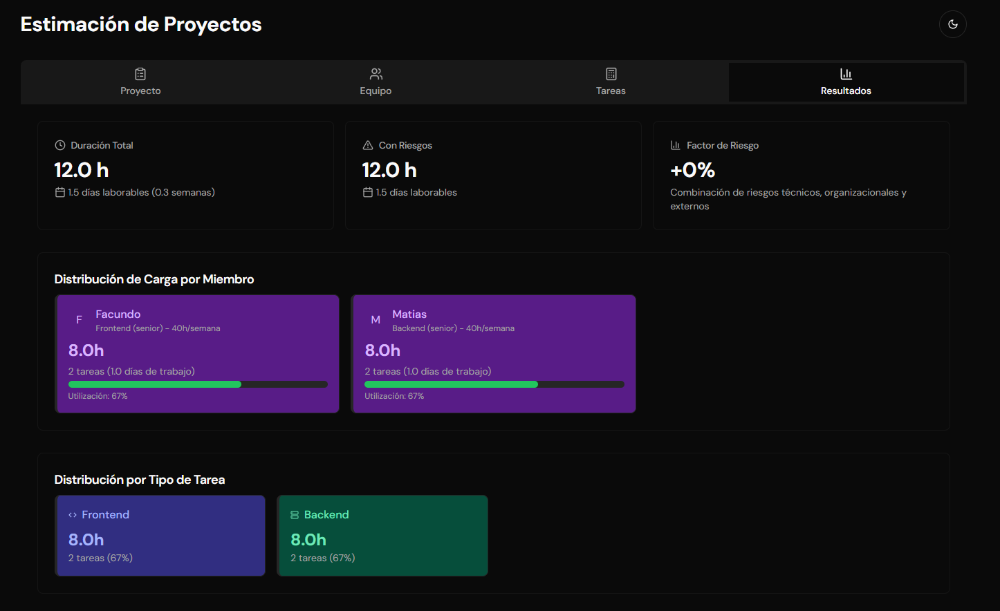
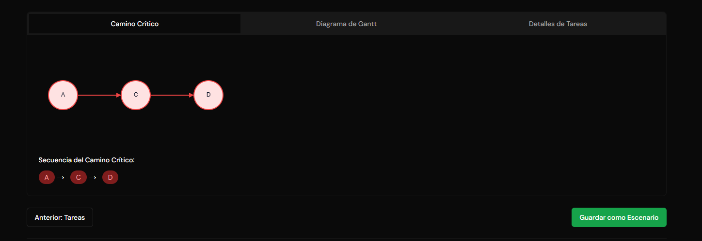
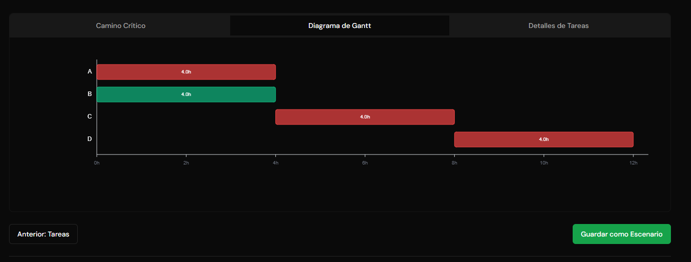
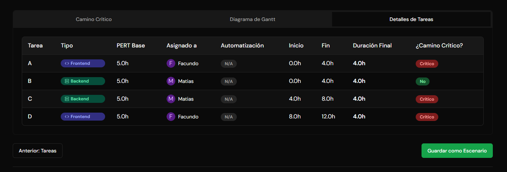
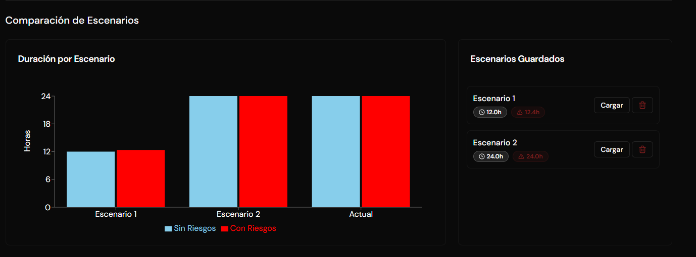
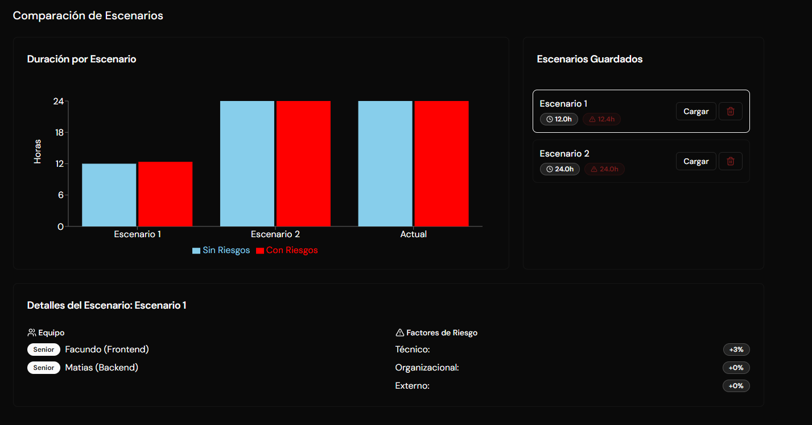


El desarrollo de la plataforma esta en un 90% terminado. Solo falta contemplar la posibilidad de si es necesario o no conectar esto con una DB para guardar escenarios o proyectos.

Proximamente link publico para testear.
